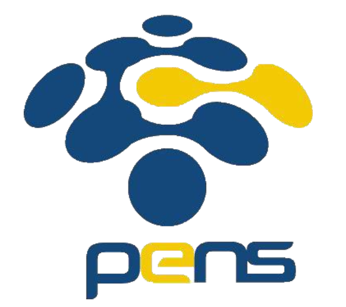
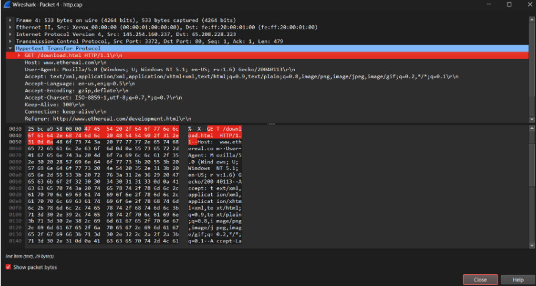
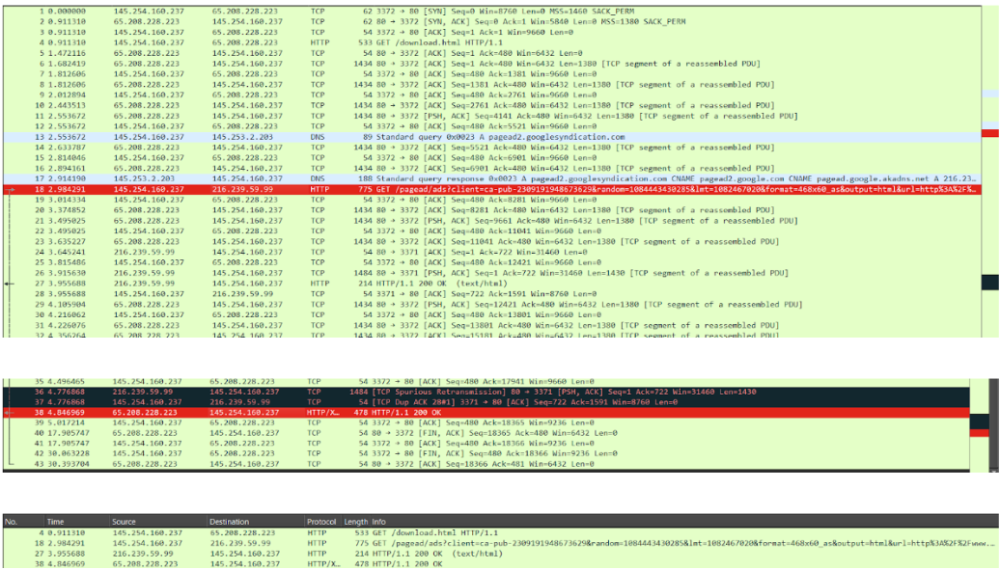
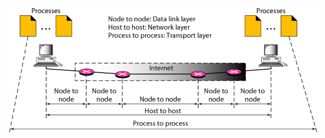

# LAPORAN RESMI  
## WORKSHOP ADMINISTRASI JARINGAN  

**Dosen Pengampu:** Dr. Ferry Astika Saputra, ST, M.Sc.  

---

 
**Nama:** Arva Zaki Fanadzan  
**Kelas:** 2 D3 IT A  
**NRP:** 3123500014  

---

## 1. Analisa File `http.cap` dengan Wireshark  
### Informasi yang dianalisis:  
- **Versi HTTP yang digunakan:** HTTP/1.1  

- **IP Address:**  
  - Client: `145.254.160.237`  
  - Server: `65.208.228.223`  
- **Waktu Client Mengirimkan HTTP Request:** `0.91130`  
- **Durasi Server Memberi Response:** `3.955688`  
- **Durasi Penyelesaian HTTP Response:**  
  - `4.846969 - 3.955688 = 0.871281`  

---

## 2. Deskripsi Gambar pada Slide  

 
Pada gambar ini, proses komunikasi terbagi menjadi tiga bagian:  
1. **Data Link Layer**  
2. **Network Layer**  
3. **Transport Layer**  

Selain itu, gambar menunjukkan dua komputer yang berkomunikasi melalui internet dengan bantuan **empat router** yang mengarahkan komunikasi antara kedua komputer tersebut.  

Data akan melewati **node to node**, membentuk satu jalur **host to host**, dan akhirnya berakhir di proses **process to process**.

---

## 3. Rangkuman Tahapan Komunikasi Menggunakan TCP  
Terdapat tiga tahapan utama dalam komunikasi menggunakan TCP:  

### 1. **Three-Way Handshake**  
- Client mengirimkan **SYN** ke server.  
- Server membalas dengan **SYN-ACK**.  
- Client mengirimkan **ACK** untuk mengonfirmasi, sehingga koneksi terbentuk.  

### 2. **Transfer Data**  
- Data dikirim dalam **segmen-segmen kecil**.  
- Setiap segmen memiliki **nomor urut**.  
- Penerima mengirim **ACK** untuk setiap data yang diterima.  

### 3. **Penutupan Koneksi**  
- Salah satu pihak mengirim **FIN** untuk memulai penutupan.  
- Pihak lain membalas dengan **ACK**.  
- Pihak lain mengirim **FIN** juga.  
- Pengirim **FIN pertama** membalas dengan **ACK**, sehingga koneksi tertutup.  
