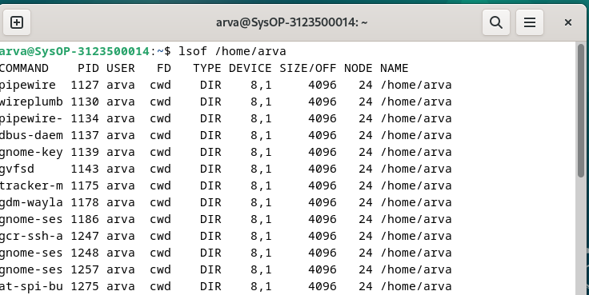
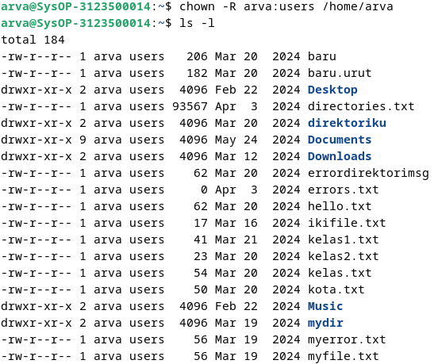

<div align="center">
  <h1>LAPORAN RESMI</h1>
  <h2>WORKSHOP ADMINISTRASI JARINGAN</h2>
  <h5>WEEK 2</h5>
</div>

<p align="center"><b>Dosen Pengampu:</b> Dr. Ferry Astika Saputra, ST, M.Sc.</p>

<p align="center">
  
</p>

<p align="center">
  <b>Nama:</b> Arva Zaki Fanadzan <br>
  <b>Kelas:</b> 2 D3 IT A <br>
  <b>NRP:</b> 3123500014
</p>

---

### BAB 4
#### Komponen dari sebuah proses
Sebuah proses terdiri dari ruang alamat dan kumpulan sturktur data yang berada pada dalam kernel.

Berikut adalah hasil parafrase dalam format markdown:  

### Ruang Alamat dan Thread pada Proses  

Ruang alamat adalah sekumpulan halaman memori yang telah dialokasikan oleh kernel untuk digunakan oleh suatu proses. Halaman memori ini berfungsi sebagai unit pengelolaan memori yang menyimpan kode program, data, serta tumpukan proses. Kernel mencatat informasi terkait proses, seperti status, prioritas, parameter penjadwalan, dan informasi lainnya dalam struktur data.  

Informasi yang dicatat oleh kernel untuk setiap proses meliputi:  

- Pemetaan ruang alamat proses  
- Status proses saat ini, seperti *Running*, *Sleeping*, dan lainnya  
- Prioritas proses  
- Sumber daya yang digunakan, seperti CPU dan memori  
- Informasi mengenai file dan port jaringan yang terbuka  
- Masker sinyal, yaitu kumpulan sinyal yang saat ini diblokir  
- Identitas pemilik proses  

Thread adalah konteks eksekusi di dalam suatu proses. Setiap proses dapat memiliki lebih dari satu thread yang berbagi ruang alamat dan sumber daya yang sama. Thread digunakan untuk mendukung eksekusi paralel dalam proses, memungkinkan beberapa tugas berjalan secara bersamaan. Thread dikenal sebagai proses ringan (*lightweight process*) karena lebih mudah dibuat dan dihancurkan dibandingkan proses penuh.  

### Identifikasi Proses  

#### **PID: Process ID**  
Setiap proses memiliki Process ID (PID) yang bersifat unik. PID adalah angka integer yang diberikan oleh kernel saat proses dibuat. PID ini digunakan untuk mengidentifikasi dan merujuk suatu proses dalam berbagai pemanggilan sistem.  

#### **PPID: Parent Process ID**  
Setiap proses memiliki Parent Process ID (PPID), yang menunjukkan proses induk atau proses yang membuatnya. PPID adalah PID dari proses yang bertindak sebagai orang tua dari proses tersebut. Informasi ini berguna dalam pemanggilan sistem untuk mengelola hubungan antara proses induk dan anak.  

#### **UID dan EUID: User ID dan Effective User ID**  
- **User ID (UID)** adalah identitas numerik pengguna yang menjalankan suatu proses.  
- **Effective User ID (EUID)** adalah UID yang digunakan oleh proses untuk menentukan hak akses terhadap sumber daya sistem seperti file dan port jaringan.  

### **Siklus Hidup Proses**  
Proses baru dibuat menggunakan pemanggilan sistem `fork()`, yang membuat salinan dari proses yang telah ada. Proses baru ini sebagian besar identik dengan induknya, tetapi memiliki PID yang berbeda dan menjalankan eksekusi secara independen.  

Saat sistem melakukan booting, kernel secara otomatis menciptakan beberapa proses, termasuk init atau systemd, yang memiliki PID 1. Proses ini bertanggung jawab untuk menjalankan skrip startup sistem dan mengelola layanan lainnya.  

### **Signals: Notifikasi untuk Proses**  
Signal adalah mekanisme yang digunakan untuk mengirim notifikasi ke suatu proses. Ada lebih dari 30 jenis sinyal yang didefinisikan dan digunakan dalam berbagai skenario, seperti:  
- Komunikasi antar proses  
- Penghentian, interupsi, atau penangguhan proses saat tombol tertentu ditekan  
- Instruksi dari administrator menggunakan perintah `kill`  
- Pemberitahuan dari kernel ketika suatu proses mengalami kesalahan fatal  
- Notifikasi dari kernel terkait kondisi khusus pada suatu proses  

### **Perintah `kill`: Mengirim Sinyal ke Proses**  
Perintah `kill` digunakan untuk mengirim sinyal ke suatu proses, umumnya untuk menghentikan eksekusi proses tersebut. Secara default, `kill` mengirimkan **sinyal TERM**, yang meminta proses untuk menghentikan dirinya sendiri dengan cara yang aman. Namun, proses dapat menangkap, memblokir, atau mengabaikan sinyal TERM.  

Jika proses tidak merespons, perintah **`kill -9`** atau **`kill -KILL`** dapat digunakan untuk mengirim **sinyal KILL**, yang tidak bisa ditangkap, diblokir, atau diabaikan oleh proses.  

#### **Sintaks Perintah `kill`**  
```
kill [-signal] pid
```
Contoh percobaan : <br>


#### ps: Pemantauan Proses
Perintah ps adalah alats utama milik system administrator untuk memantau proses. Perintah ini dapat menunjukkan PID, UID, prioritas, dan terminal kontrol dari proses. ps juga memberi informasi seberapa banyak pemakaian memori dari proses, seberapa banyak waktu CPU telah dipakai, dan kondisi proses-proses sekarang.
syntax perintah ps

Contoh percobaan : <br>


### **top: Pemantauan Sistem Secara Interaktif**  

Perintah `top` digunakan untuk memantau aktivitas sistem secara real-time dengan tampilan yang diperbarui secara dinamis. Perintah ini menampilkan ringkasan sistem serta daftar proses atau thread yang sedang berjalan dan dikelola oleh kernel Linux.  

Pengguna dapat menyesuaikan tampilan informasi yang ditampilkan, seperti jenis data, urutan, dan ukuran proses. Pengaturan yang telah dikonfigurasi dapat disimpan sehingga tetap berlaku meskipun sistem telah di-restart.  

Secara default, tampilan `top` akan diperbarui setiap 1-2 detik, bergantung pada konfigurasi sistem.  

Contoh percobaan : <br>


Selain top, ada juga perintah htop, yang merupakan pemantau proses interaktif untuk sistem Unix. htop adalah aplikasi berbasis teks (untuk konsol atau terminal X) dan memerlukan library ncurses. Perintah ini mirip dengan top, tetapi memungkinkan pengguna untuk menggulir layar secara vertikal dan horizontal, sehingga semua proses yang berjalan di sistem beserta perintah lengkapnya dapat dilihat

Contoh Percobaan : <br>


### **`nice` dan `renice`: Mengubah Prioritas Proses**  

Niceness adalah nilai numerik yang digunakan untuk memberi petunjuk kepada kernel mengenai tingkat prioritas suatu proses dibandingkan dengan proses lain yang juga memerlukan waktu CPU.  

- Proses dengan prioritas rendah dianggap kurang penting dan akan mendapatkan waktu CPU lebih sedikit.  
- Proses dengan prioritas tinggi dianggap lebih penting dan akan mendapatkan lebih banyak alokasi CPU.  

Niceness bekerja dengan konsep berikut:  
- Nilai niceness tinggi berarti prioritas proses lebih rendah, karena Anda "bersikap baik" dengan memberikan kesempatan lebih besar kepada proses lain.  
- Nilai niceness rendah atau negatif berarti prioritas lebih tinggi, karena proses Anda akan lebih diutamakan oleh sistem.  

Rentang nilai niceness berbeda tergantung sistem operasi:  
- Linux: -20 hingga +19  
- FreeBSD: -20 hingga +20  

### **`nice`: Menjalankan Proses dengan Prioritas Tertentu**  
Perintah `nice` digunakan untuk memulai suatu proses dengan nilai niceness yang telah ditentukan.  

#### **Sintaks Perintah `nice`**  
```
nice -n <nilai_niceness> <perintah>
```

### **`/proc` Filesystem**  

Direktori `/proc` adalah pseudo-filesystem dalam Linux yang digunakan oleh kernel untuk menyediakan berbagai informasi mengenai status sistem. Direktori ini berisi data tentang proses yang sedang berjalan, serta statistik sistem dan informasi lainnya.  

Meskipun namanya `/proc`, isi dari direktori ini tidak terbatas pada informasi proses saja, tetapi juga mencakup berbagai parameter sistem yang dapat diakses secara dinamis.  

Contoh : <br> 
 <br>


#### Strace dan Struss
Perintah strace (Linux) dan truss (FreeBSD) digunakan untuk melacak system calls (panggilan sistem) dan signals (sinyal) yang dilakukan oleh suatu proses. Alat ini berguna untuk melakukan debugging program atau memahami apa yang sedang dilakukan oleh suatu program.

### **Runaway Process: Proses yang Tidak Terkendali**  

**Runaway Process** adalah proses yang berhenti merespons sistem dan berjalan tanpa kendali. Proses ini mengabaikan prioritas penjadwalannya dan terus menggunakan **100% CPU**, menyebabkan sistem menjadi sangat lambat karena proses lain hanya mendapatkan akses terbatas ke CPU.  

### **Mengatasi Runaway Process**  
- Menghentikan proses: Gunakan perintah `kill` untuk mengakhiri runaway process.  
- Menyelidiki proses:  
  - Linux: Gunakan perintah `strace` untuk menganalisis aktivitas proses.  
  - FreeBSD: Gunakan perintah `truss` untuk memantau eksekusi sistem proses.  
- Memeriksa penggunaan filesystem: Gunakan perintah `df` untuk melihat kapasitas dan pemakaian ruang penyimpanan pada sistem.  

Contoh : <br>


Untuk melihat proses yang dibuka oleh runaway process menggunakan perintah lsof.



### **Proses Periodik**  

**Proses periodik** adalah tugas yang dieksekusi secara otomatis pada waktu yang telah dijadwalkan. Di sistem operasi Linux, perintah terjadwal dapat dijalankan menggunakan **cron** (atau `crond` di RedHat) serta **systemd timer**, yang menawarkan alternatif lebih fleksibel dan kuat.  

### **Cron: Menjadwalkan Perintah**  
Cron adalah daemon yang berjalan sejak sistem dinyalakan dan tetap aktif selama sistem beroperasi. Daemon ini membaca file konfigurasi yang disebut crontab (cron table), yang berisi daftar perintah beserta jadwal eksekusinya.  

Crontab menjalankan perintah melalui shell (`sh`), sehingga hampir semua perintah yang dapat dieksekusi secara manual melalui shell juga dapat dijadwalkan menggunakan cron.  

### **Format Crontab:**  
```
*     *     *     *     *  command_to_execute
-     -     -     -     -
|     |     |     |     |
|     |     |     |     +----- Hari dalam minggu (0-6, 0=Minggu)
|     |     |     +------- Bulan (1-12)
|     |     +--------- Tanggal (1-31)
|     +----------- Jam (0-23)
+------------- Menit (0-59)
```

Contoh penggunaan crontab<br>
Menjalankan perintah setiap hari pukul 2:30 pagi:
```
30 2 * * * command
```
Menjalankan skrip Python setiap tanggal 1 pukul 2:30 pagi:
```bash
30 2 1 * * /usr/bin/python3 /path/to/script.py
```
Menjalankan perintah setiap 30 menit:
```bash
*/30 * * * * command
```

- Systemd Timer: Alternatif Modern untuk Cron<br>
Systemd timer adalah file konfigurasi unit systemd yang berekstensi `.timer`. Timer ini lebih fleksibel dan powerful dibanding cron, karena dapat diaktifkan berdasarkan waktu, boot sistem, atau event tertentu diaktifkan oleh service unit yang sesuai, dan dapat dikelola menggunakan perintah `systemctl`.<br>
Contoh Systemd Timer:<br>
```bash
systemctl list-timers
```

Contoh file timer (logrotate.timer):<br>
```
[Unit]
Description=Daily rotation of log files

[Timer]
OnCalendar=daily
AccuracySec=1h
Persistent=true

[Install]
WantedBy=timers.target
```
- Kegunaan Umum Tugas Terjadwal:<br>
  - Mengirim Email: Mengirim laporan atau hasil perintah secara otomatis melalui email.<br>
  - Membersihkan Filesystem: Menjalankan skrip untuk menghapus file lama, seperti membersihkan direktori sampah setiap hari.<br>
  - Rotasi Log File: Membagi file log menjadi beberapa segmen berdasarkan ukuran atau tanggal, dan menyimpan versi lama.<br>
  - Menjalankan Batch Jobs: Menjalankan tugas panjang seperti pemrosesan pesan antrian atau ETL (Extract, Transform, Load) ke data warehouse.<br>
  - Backup dan Mirroring: Menjadwalkan backup otomatis ke sistem remote atau membuat mirror (salinan byte-per-byte) menggunakan rsync.<br>


# **Bab 5: Filesystem**  

## **Pengertian Filesystem**  
Filesystem berfungsi untuk merepresentasikan serta mengelola sumber daya penyimpanan dalam sistem. Secara umum, filesystem terdiri dari empat elemen utama:  

1. **Namespace** – Metode pemberian nama objek dan pengorganisasiannya dalam struktur hierarki.  
2. **API** – Sekumpulan sistem panggilan (*system calls*) yang memungkinkan navigasi dan manipulasi objek.  
3. **Model Keamanan** – Mekanisme untuk mengamankan, menyembunyikan, atau membagikan akses ke suatu objek.  
4. **Implementasi** – Perangkat lunak yang menghubungkan model logis dengan perangkat keras penyimpanan.  

Filesystem berbasis disk yang umum digunakan mencakup:  
- **ext4**, **XFS**, **UFS**, **ZFS (Oracle)**, dan **Btrfs**.  
- Filesystem lain yang tersedia meliputi **VxFS (Veritas)** dan **JFS (IBM)**.  
- Selain itu, terdapat filesystem khusus seperti **FAT/NTFS (Windows)** dan **ISO 9660 (CD/DVD)**.  

Filesystem modern cenderung berfokus pada peningkatan kecepatan serta keandalan dari fungsi tradisionalnya, atau menambahkan fitur baru di atas standar filesystem yang sudah ada.  

---

## **Pathname (Jalur File)**  
Dalam sistem operasi **Windows** dan **macOS**, istilah **"folder"** sering digunakan untuk merujuk pada **direktori**, yang secara teknis memiliki makna yang sama.  

Jalur direktori yang mengarah ke suatu file disebut **pathname**. Jalur ini merupakan rangkaian teks yang menunjukkan lokasi file dalam struktur hierarki filesystem.  

### **Jenis Pathname**  
- **Jalur Absolut** – Menunjukkan lokasi lengkap dari root hingga file.  
  - Contoh: `/home/username/file.txt`  
- **Jalur Relatif** – Menunjukkan lokasi berdasarkan posisi direktori saat ini.  
  - Contoh: `./file.txt`  

---

## **Mounting dan Unmounting Filesystem**  
Filesystem terdiri dari beberapa bagian kecil, yang masing-masing mencakup sebuah direktori beserta subdirektori dan file di dalamnya.  

- Struktur keseluruhan filesystem sering disebut **file tree (pohon file)**.  
- Istilah **filesystem** merujuk pada cabang-cabang dalam pohon tersebut.  

Untuk menambahkan filesystem ke dalam hierarki, digunakan perintah **mount**, yang menetapkan sebuah direktori sebagai titik kait (**mount point**) untuk filesystem baru.  

### **Contoh Perintah Mounting**  
```
mount /dev/sda4 /users
```
Contoh : <br>


Output lsof akan menampilkan daftar proses yang mengakses direktori/file tersebut

# **Organisasi Pohon File di Sistem UNIX**  

Dalam sistem UNIX, berbagai konvensi penamaan yang tidak selalu kompatibel digunakan secara bersamaan. Selain itu, berbagai jenis file tersebar di dalam namespace tanpa pola yang jelas. Hal ini menyebabkan proses pembaruan sistem operasi menjadi lebih kompleks.  

---

## **Struktur Root Filesystem**  

Struktur utama dalam filesystem UNIX dimulai dari direktori root (`/`), yang berisi kumpulan file dan subdirektori penting untuk operasi dasar sistem. Berikut adalah beberapa direktori utama dalam root filesystem:  

- **`/` (root)** – Direktori utama yang mencakup kumpulan file dan subdirektori esensial.  
- **`/boot`** – Menyimpan kernel sistem operasi, meskipun lokasi dan namanya dapat berbeda tergantung sistem. Pada BSD dan beberapa varian UNIX lainnya, kernel terdiri dari beberapa bagian terpisah, bukan satu file tunggal.  
- **`/etc`** – Direktori yang berisi file konfigurasi serta sistem yang bersifat kritis.  
- **`/sbin` & `/bin`** – Menyimpan utilitas penting yang digunakan dalam administrasi sistem.  
- **`/tmp`** – Direktori untuk menyimpan file sementara. Tidak selalu menjadi bagian dari root filesystem.  
- **`/dev`** – Awalnya merupakan bagian dari root filesystem, tetapi kini umumnya dipasang (*mounted*) sebagai filesystem virtual yang terpisah.  

---

## **Direktori Tambahan**  

- **`/lib` atau `/lib64`** – Menyimpan pustaka bersama (*shared libraries*) dan komponen penting seperti *C preprocessor*. Dalam beberapa sistem, direktori ini dipindahkan ke `/usr/lib`, dengan `/lib` berfungsi sebagai *symbolic link*.  
- **`/usr`** – Berisi program non-kritis, dokumentasi daring (*man pages*), serta pustaka tambahan. Di sistem FreeBSD, banyak konfigurasi lokal yang ditempatkan di `/usr/local`.  
- **`/var`** – Menyimpan file yang sering berubah atau bervariasi antar sistem, seperti direktori spool (untuk email atau pencetakan), file log, dan data akuntansi.  

Agar sistem dapat melakukan booting hingga mode multiuser, direktori **`/usr`** dan **`/var`** harus tersedia. Jika keduanya tidak dapat diakses, sistem kemungkinan hanya bisa masuk ke mode *single-user* untuk tujuan pemeliharaan. Beberapa direktori penting dalam struktur ini meliputi:  

- **`/usr/bin`** – Menyimpan berbagai program pengguna.  
- **`/var/log`** – Menyimpan file log sistem.  

---

## **Tipe File dalam Filesystem UNIX**  

Filesystem UNIX umumnya mendukung tujuh jenis file utama:  

1. **File Reguler** – File biasa yang berisi data atau kode program.  
2. **Direktori** – Struktur yang digunakan untuk mengorganisasi file dan subdirektori.  
3. **File Device Karakter** – Berinteraksi dengan perangkat (*devices*) berbasis karakter, seperti terminal atau printer.  
4. **File Device Blok** – Digunakan untuk perangkat penyimpanan berbasis blok, seperti hard drive atau USB.  
5. **Socket Domain Lokal** – Mekanisme komunikasi antar proses dalam sistem yang sama.  
6. **Pipa Bernama (FIFO)** – Saluran komunikasi antar proses yang bekerja secara antrian.  
7. **Tautan Simbolik (Symbolic Link)** – Referensi ke file atau direktori lain, mirip dengan *shortcut* di Windows.  

Untuk mengetahui jenis file dalam UNIX, gunakan perintah berikut:  

```
file /bin/bash
```
Contoh : <br>


Gunakan ls -ld untuk menampilkan informasi dari direktori:
```
ls -ld
```
Contoh : <br>


Berikut penjelasan singkat mengenai jenis file:

- File Reguler: Kumpulan byte tanpa struktur khusus (contoh: file teks, program, library).
- Direktori: Referensi bernama ke file/direktori lain.
- Hard Link: Memberi nama alternatif untuk file yang sama.

```
ln /etc/passwd /tmp/passwd  # Membuat hard link  
ls -i /etc/passwd /tmp/passwd  # Menampilkan inode yang sama 
```

Contoh : <br>


- File Device (Karakter/Blok): Digunakan untuk berkomunikasi dengan hardware (contoh: /dev/tty0 untuk port serial).
- Nomor major: Mengidentifikasi driver.
- Nomor minor: Mengidentifikasi unit fisik (misal: /dev/tty0 = major 4, minor 0).
- Socket Domain Lokal: Memungkinkan komunikasi antar-proses di host yang sama (contoh: syslog, X Window System).
- Pipa Bernama (FIFO): Jalur komunikasi antar-proses dalam host.
- Tautan Simbolik: Tautan fleksibel ke file/direktori (bisa lintas filesystem).

```
$ ln -s /bin /usr/bin  # Membuat tautan simbolik
$ ls -l /usr/bin  
```
Contoh : <br>


## Bab 5: Filesystem

Filesystem digunakan untuk merepresentasikan serta mengelola sumber daya penyimpanan dalam sistem. Secara umum, filesystem terdiri dari empat elemen utama:

1. **Namespace** – Metode pemberian nama objek dan pengorganisasiannya dalam struktur hierarki.
2. **API** – Sekumpulan sistem panggilan (*system calls*) yang memungkinkan navigasi dan manipulasi objek.
3. **Model Keamanan** – Mekanisme untuk mengamankan, menyembunyikan, atau membagikan akses ke suatu objek.
4. **Implementasi** – Perangkat lunak yang menghubungkan model logis dengan perangkat keras penyimpanan.

Filesystem berbasis disk yang umum digunakan meliputi **ext4, XFS, UFS, ZFS (Oracle),** dan **Btrfs**. Beberapa lainnya seperti **VxFS (Veritas)** dan **JFS (IBM)** juga tersedia. Selain itu, terdapat filesystem spesifik seperti **FAT/NTFS (Windows)** dan **ISO 9660 (CD/DVD)**.

Filesystem modern berfokus pada peningkatan kecepatan serta keandalan dari fungsi tradisionalnya, atau menambahkan fitur baru di atas standar filesystem yang sudah ada.

### Pathname (Jalur File)
Dalam sistem operasi **Windows** dan **macOS**, istilah "folder" sering digunakan untuk merujuk pada **direktori**, yang memiliki makna teknis yang sama.

Jalur direktori yang mengarah ke suatu file disebut **pathname**, yaitu rangkaian teks yang menunjukkan lokasi file dalam struktur hierarki filesystem.

- **Jalur Absolut** – Menunjukkan lokasi lengkap dari root hingga file.
  - Contoh: `/home/username/file.txt`
- **Jalur Relatif** – Menunjukkan lokasi berdasarkan posisi direktori saat ini.
  - Contoh: `./file.txt`

### Mounting dan Unmounting Filesystem
Filesystem terdiri dari beberapa bagian kecil, yang mencakup direktori beserta subdirektori dan file di dalamnya. Struktur keseluruhan filesystem sering disebut **file tree** (*pohon file*), sedangkan filesystem sendiri merujuk pada cabang-cabang dalam pohon tersebut.

Untuk menambahkan filesystem ke dalam hierarki, digunakan perintah **mount**, yang menetapkan sebuah direktori sebagai **titik kait (mount point)** untuk filesystem baru.

## Organisasi Pohon File di Sistem UNIX

Berbagai konvensi penamaan yang tidak kompatibel digunakan secara bersamaan, dan jenis file berbeda tersebar secara acak dalam namespace. Inilah yang membuat upgrade sistem operasi menjadi sulit.

### Struktur Root Filesystem:

- `/` (root): Direktori utama yang mencakup set minimal file dan subdirektori.
- `/boot`: Biasanya menyimpan kernel OS, meskipun lokasi pastinya bisa bervariasi.
- `/etc`: Berisi file konfigurasi dan sistem yang krusial.
- `/sbin` dan `/bin`: Menyimpan utilitas penting untuk administrasi sistem.
- `/tmp`: Menampung file sementara (tidak selalu bagian dari root filesystem).
- `/dev`: Sekarang merupakan filesystem virtual yang di-*mount* terpisah.

### Direktori Lain:

- `/lib` atau `/lib64`: Berisi *shared library* dan komponen seperti C preprocessor. Beberapa sistem memindahkannya ke `/usr/lib` dengan `/lib` sebagai *symbolic link*.
- `/usr`: Menyimpan program standar non-kritis, *man pages*, dan library.
- `/var`: Berisi direktori *spool* (email/cetak), file log, data akunting, dan file yang sering berubah.

### Jenis File dalam Filesystem UNIX
Filesystem UNIX umumnya mendefinisikan 7 jenis file:

1. **File Reguler**
2. **Direktori**
3. **File Device Karakter**
4. **File Device Blok**
5. **Socket Domain Lokal**
6. **Pipa Bernama (FIFO)**
7. **Tautan Simbolik**

Untuk mengetahui jenis file, gunakan perintah:
```sh
file /bin/bash
```

## Atribut File
Dalam model filesystem UNIX/Linux, setiap file memiliki **9 bit izin** yang menentukan siapa yang dapat membaca, menulis, dan mengeksekusi file. Ditambah **3 bit tambahan** yang mempengaruhi operasi program eksekusi, bit-bit ini membentuk **mode file**.

- **Bit izin**: `rwxr-xr--` (9 bit).
- **Bit tambahan**: *setuid, setgid, sticky bit* (3 bit).
- **Bit tipe file**: Menunjukkan jenis file (*regular file, direktori*).

### Pengizinan Bit
Bit izin pada file dibagi menjadi tiga grup:

1. **u (user)** – Pemilik file.
2. **g (group)** – Grup file.
3. **o (others)** – Pengguna lain.

Bit ini bisa direpresentasikan dalam notasi oktal:

| Izin  | Oktal | Keterangan |
|--------|------|-------------|
| rwx    | 7    | Baca, tulis, eksekusi |
| rw-    | 6    | Baca, tulis |
| r-x    | 5    | Baca, eksekusi |
| r--    | 4    | Hanya baca |
| --x    | 1    | Hanya eksekusi |

Pada **file reguler**:
- Bit **baca** memungkinkan file dibaca.
- Bit **tulis** memungkinkan file dimodifikasi atau dipotong.
- Bit **eksekusi** memungkinkan file dieksekusi.

Pada **direktori**:
- Bit **eksekusi** memungkinkan direktori dimasuki.
- Kombinasi **baca & eksekusi** memungkinkan isi direktori dibaca.
- Kombinasi **tulis & eksekusi** memungkinkan file dibuat, dihapus, dan diganti namanya di dalam direktori.

### Bit Setuid dan Setgid
- **Setuid (4000)**: Saat file dieksekusi, pemilik file sementara menjadi pemilik asli file.
- **Setgid (2000)**:
  - Pada file: Grup file sementara menjadi grup asli file.
  - Pada direktori: File yang dibuat akan memiliki grup yang sama dengan direktori, bukan grup pengguna yang membuat file.

### Sticky Bit
- **Sticky bit (1000)**: Ketika diatur pada direktori, hanya pemilik file yang dapat menghapus atau mengganti nama file tersebut.
- Biasanya digunakan pada `/tmp`.

### Perintah `ls`: Melihat Atribut File
Gunakan perintah berikut untuk menampilkan daftar file dan atributnya:
```sh
ls -l
```

Output dari perintah ini mencakup:
- Mode file
- Jumlah *hard link*
- Pemilik file
- Grup file
- Ukuran file (dalam byte)
- Waktu modifikasi terakhir
- Nama file

Untuk melihat file *device*:
```sh
ls -l /dev/tty0
```

---
Contoh : <br>


## Bab 5: Filesystem

Filesystem digunakan untuk merepresentasikan serta mengelola sumber daya penyimpanan dalam sistem. Secara umum, filesystem terdiri dari empat elemen utama:

1. **Namespace** – Metode pemberian nama objek dan pengorganisasiannya dalam struktur hierarki.
2. **API** – Sekumpulan sistem panggilan (*system calls*) yang memungkinkan navigasi dan manipulasi objek.
3. **Model Keamanan** – Mekanisme untuk mengamankan, menyembunyikan, atau membagikan akses ke suatu objek.
4. **Implementasi** – Perangkat lunak yang menghubungkan model logis dengan perangkat keras penyimpanan.

Filesystem berbasis disk yang umum digunakan meliputi **ext4, XFS, UFS, ZFS (Oracle),** dan **Btrfs**. Beberapa lainnya seperti **VxFS (Veritas)** dan **JFS (IBM)** juga tersedia. Selain itu, terdapat filesystem spesifik seperti **FAT/NTFS (Windows)** dan **ISO 9660 (CD/DVD)**.

Filesystem modern berfokus pada peningkatan kecepatan serta keandalan dari fungsi tradisionalnya, atau menambahkan fitur baru di atas standar filesystem yang sudah ada.

### Pathname (Jalur File)
Dalam sistem operasi **Windows** dan **macOS**, istilah "folder" sering digunakan untuk merujuk pada **direktori**, yang memiliki makna teknis yang sama.

Jalur direktori yang mengarah ke suatu file disebut **pathname**, yaitu rangkaian teks yang menunjukkan lokasi file dalam struktur hierarki filesystem.

- **Jalur Absolut** – Menunjukkan lokasi lengkap dari root hingga file.
  - Contoh: `/home/username/file.txt`
- **Jalur Relatif** – Menunjukkan lokasi berdasarkan posisi direktori saat ini.
  - Contoh: `./file.txt`

### Mounting dan Unmounting Filesystem
Filesystem terdiri dari beberapa bagian kecil, yang mencakup direktori beserta subdirektori dan file di dalamnya. Struktur keseluruhan filesystem sering disebut **file tree** (*pohon file*), sedangkan filesystem sendiri merujuk pada cabang-cabang dalam pohon tersebut.

Untuk menambahkan filesystem ke dalam hierarki, digunakan perintah **mount**, yang menetapkan sebuah direktori sebagai **titik kait (mount point)** untuk filesystem baru.

## Organisasi Pohon File di Sistem UNIX

Berbagai konvensi penamaan yang tidak kompatibel digunakan secara bersamaan, dan jenis file berbeda tersebar secara acak dalam namespace. Inilah yang membuat upgrade sistem operasi menjadi sulit.

### Struktur Root Filesystem:

- `/` (root): Direktori utama yang mencakup set minimal file dan subdirektori.
- `/boot`: Biasanya menyimpan kernel OS, meskipun lokasi pastinya bisa bervariasi.
- `/etc`: Berisi file konfigurasi dan sistem yang krusial.
- `/sbin` dan `/bin`: Menyimpan utilitas penting untuk administrasi sistem.
- `/tmp`: Menampung file sementara (tidak selalu bagian dari root filesystem).
- `/dev`: Sekarang merupakan filesystem virtual yang di-*mount* terpisah.

### Direktori Lain:

- `/lib` atau `/lib64`: Berisi *shared library* dan komponen seperti C preprocessor. Beberapa sistem memindahkannya ke `/usr/lib` dengan `/lib` sebagai *symbolic link*.
- `/usr`: Menyimpan program standar non-kritis, *man pages*, dan library.
- `/var`: Berisi direktori *spool* (email/cetak), file log, data akunting, dan file yang sering berubah.

### Jenis File dalam Filesystem UNIX
Filesystem UNIX umumnya mendefinisikan 7 jenis file:

1. **File Reguler**
2. **Direktori**
3. **File Device Karakter**
4. **File Device Blok**
5. **Socket Domain Lokal**
6. **Pipa Bernama (FIFO)**
7. **Tautan Simbolik**

Untuk mengetahui jenis file, gunakan perintah:
```sh
file /bin/bash
```

## Atribut File
Dalam model filesystem UNIX/Linux, setiap file memiliki **9 bit izin** yang menentukan siapa yang dapat membaca, menulis, dan mengeksekusi file. Ditambah **3 bit tambahan** yang mempengaruhi operasi program eksekusi, bit-bit ini membentuk **mode file**.

- **Bit izin**: `rwxr-xr--` (9 bit).
- **Bit tambahan**: *setuid, setgid, sticky bit* (3 bit).
- **Bit tipe file**: Menunjukkan jenis file (*regular file, direktori*).

### Pengizinan Bit
Bit izin pada file dibagi menjadi tiga grup:

1. **u (user)** – Pemilik file.
2. **g (group)** – Grup file.
3. **o (others)** – Pengguna lain.

Bit ini bisa direpresentasikan dalam notasi oktal:

| Izin  | Oktal | Keterangan |
|--------|------|-------------|
| rwx    | 7    | Baca, tulis, eksekusi |
| rw-    | 6    | Baca, tulis |
| r-x    | 5    | Baca, eksekusi |
| r--    | 4    | Hanya baca |
| --x    | 1    | Hanya eksekusi |

### Jenis File Device
Huruf **c** di awal baris menunjukkan bahwa file tersebut adalah file perangkat karakter. Angka yang mengikuti, seperti `4, 0`, adalah nomor perangkat **major** dan **minor**.

### Mengubah Izin dengan `chmod`
Perintah `chmod` digunakan untuk mengubah mode file. Terdapat dua metode utama:

1. **Notasi simbolik**:
   - `u+w` → Menambahkan izin tulis untuk pemilik file.
   - `ug=rw,o=r` → Memberikan izin baca/tulis untuk pemilik dan grup, serta izin baca untuk pengguna lain.
   - `a-x` → Menghapus izin eksekusi untuk semua pengguna.
   - `ug=srx,o=` → Mengatur bit setuid, setgid, dan sticky untuk pemilik dan grup (baca/eksekusi).
   - `g=u` → Menyamakan izin grup dengan pemilik.

2. **Menyalin izin dari file lain**:
   ```sh
   chmod --reference=file_sumber file_target
   ```

### Mengubah Kepemilikan dengan `chown`
Perintah `chown` digunakan untuk mengubah kepemilikan dan grup sebuah file. Dengan opsi `-R`, perubahan akan diterapkan secara rekursif ke seluruh isi direktori.

Contoh:
```sh
chown -R arva:users /home/arva
```

Contoh : <br>



**chgrp**: Mengubah Grup
Perintah chgrp digunakan untuk mengubah grup sebuah file. Opsi -R membuat chgrp mengubah grup isi file secara rekursif. Contoh:
```
$ chgrp -R users /home/arva
```
Contoh : <br>


## Bab 6: Instalasi dan Manajemen Perangkat Lunak

## Instalasi Sistem Operasi

Proses instalasi dasar pada distribusi Linux dan FreeBSD relatif sederhana. Pada perangkat fisik, boot dapat dilakukan melalui CD, DVD, atau USB drive. Untuk mesin virtual, boot dapat dilakukan menggunakan file ISO. Berkat aplikasi GUI yang memberikan panduan langkah demi langkah, instalasi sistem operasi dasar dari media lokal tergolong mudah.

## Instalasi dari Jaringan

Pendekatan menggunakan media lokal menjadi tidak efisien ketika harus menginstal OS pada banyak komputer. Proses tersebut membutuhkan waktu lama, rawan kesalahan, dan repetitif. Alternatif yang lebih baik adalah instalasi OS melalui server jaringan—praktik yang umum diterapkan di pusat data dan lingkungan cloud.

Metode yang paling lazim memanfaatkan DHCP dan TFTP untuk melakukan boot sistem tanpa media fisik. Selanjutnya, sistem akan mengunduh file instalasi OS dari server jaringan menggunakan protokol HTTP, FTP, atau NFS. File instalasi dapat disimpan pada server yang sama maupun pada server terpisah.

Instalasi dapat diatur sepenuhnya otomatis melalui PXE (Preboot eXecution Environment)—standar dari Intel yang memungkinkan sistem melakukan boot dari antarmuka jaringan. 

PXE berfungsi seperti sistem operasi mini yang tertanam pada ROM kartu jaringan. Ia menyediakan kemampuan jaringan melalui API standar yang digunakan oleh BIOS sistem. Kolaborasi ini memungkinkan satu boot loader melakukan netboot pada PC dengan dukungan PXE tanpa perlu menyediakan driver khusus untuk setiap kartu jaringan.

## Sistem Manajemen Paket Linux

Ada dua format paket yang umum digunakan pada sistem Linux:
1. RPM - digunakan oleh Red Hat, CentOS, SUSE, Amazon Linux, dan beberapa distribusi lainnya
2. Format .deb - digunakan oleh Debian dan Ubuntu

Kedua format ini memiliki fungsionalitas yang serupa.

Sistem pengemasan RPM dan .deb kini berfungsi sebagai alat manajemen konfigurasi dua lapis:
- Lapisan dasar: alat untuk instalasi, penghapusan, dan kueri paket (`rpm` untuk RPM dan `dpkg` untuk .deb)
- Lapisan atas: sistem yang mampu menemukan dan mengunduh paket dari internet, menganalisis ketergantungan antar-paket, dan memperbarui semua paket pada sistem. `yum` (Yellowdog Updater, Modified) bekerja dengan sistem RPM, sementara APT (Advanced Package Tool) berasal dari ekosistem .deb namun dapat bekerja baik dengan paket .deb maupun RPM.

## Manajemen Paket Tingkat Tinggi

Alat manajemen paket tingkat tinggi adalah yang paling sering digunakan. Alat ini memungkinkan instalasi, penghapusan, dan pembaruan paket. Mereka juga memfasilitasi pencarian paket dan menampilkan daftar paket yang terinstal pada sistem.

### Repositori Paket
Distributor Linux mengelola repositori perangkat lunak yang kompatibel dengan sistem manajemen paket pilihan mereka. Konfigurasi default untuk sistem manajemen paket biasanya mengarah ke satu atau beberapa server web atau FTP yang dikendalikan oleh distributor.

Beberapa konsep penting:
- **Release**: snapshot konsisten dari kumpulan paket
- **Komponen**: subset perangkat lunak dalam suatu release
- **Arsitektur**: mewakili kelas perangkat keras dengan asumsi bahwa mesin dalam kelas arsitektur yang sama cukup serupa untuk menjalankan biner yang sama (contoh: arsitektur i386 dari release Fedora 20)

### APT: Advanced Package Tool
APT adalah sekumpulan alat untuk mengelola paket Debian dan merupakan sistem manajemen paket yang paling banyak digunakan untuk sistem berbasis Debian. Komponen-komponennya meliputi:

- **apt-get**: Alat baris perintah untuk menangani instalasi, penghapusan, dan pembaruan paket
- **apt-cache**: Alat untuk mencari dan mengkueri cache paket APT
- **apt-file**: Alat untuk mencari file di dalam paket
- **apt-show-versions**: Alat untuk menampilkan versi paket
- **aptitude**: Antarmuka tingkat tinggi untuk sistem manajemen paket yang dapat melakukan sebagian besar tugas apt-get dan banyak lagi
- **apt-mirror**: Alat untuk membuat mirror dari repositori paket

Catatan penting saat menggunakan APT pada sistem Ubuntu: abaikan keberadaan `dselect` yang berfungsi sebagai frontend untuk sistem paket Debian.

### yum: Yellowdog Updater, Modified
Yum adalah manajer paket untuk sistem Linux yang kompatibel dengan RPM. Ini merupakan alat tingkat tinggi yang melakukan resolusi dependensi saat menginstal, memperbarui, dan menghapus paket. Yum dapat mengelola paket dari repositori terinstal dan melakukan operasi baris perintah pada paket individual.

## Konfigurasi dan Lokalisasi Perangkat Lunak

Salah satu tantangan utama dalam administrasi sistem adalah mengadaptasi sistem ke lingkungan lokal atau cloud. Menangani masalah lokalisasi dengan pendekatan terstruktur dan dapat direproduksi membantu menghindari terciptanya sistem "snowflake"—sistem yang sulit dipulihkan setelah insiden besar.