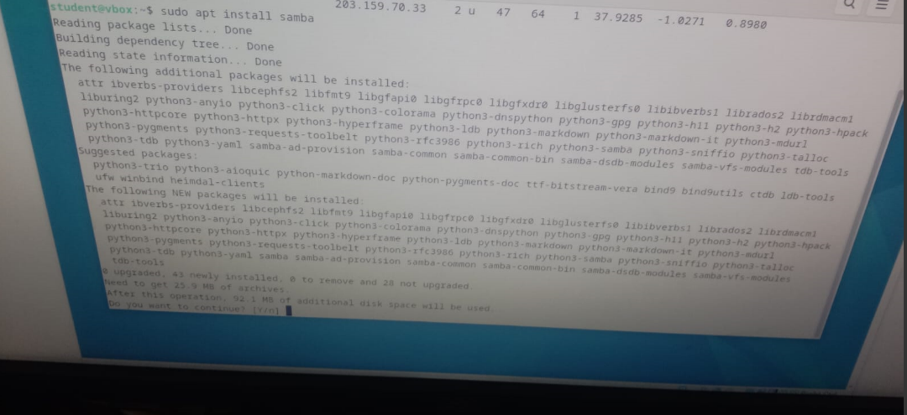

<div align="center">
  <h1>LAPORAN RESMI</h1>
  <h2>WORKSHOP ADMINISTRASI JARINGAN</h2>
  <h5>WEEK 3</h5>
</div>

<p align="center"><b>Dosen Pengampu:</b> Dr. Ferry Astika Saputra, ST, M.Sc.</p>

<p align="center">
  
</p>

<p align="center">
  <b>Nama:</b> Arva Zaki Fanadzan <br>
  <b>Kelas:</b> 2 D3 IT A <br>
  <b>NRP:</b> 3123500014
</p>

---

#### A. Instalasi NTP client 
1. Melakukan instalasi paket ntp dengan command
``` sudo apt update ``` untuk mengupdate paket paket apt menjadi versi terbaru
``` sudo apt install ntp ``` untuk melakukan install package ntp melalui ntp

Contoh : <br>


2. Mengubah konfigurasi dari file config ntp yang berada pada /etc/ntpsec/ntp.conf
mengubah server yang sebelumnya menggunakan debian menjadi server indonesia

Contoh : <br>


3. Melakukan Restart ntp dan mengecek status dari ntp dengan command
``` sudo systemctl restart ntp ```
``` sudo systemctl status ntp ```
Contoh : <br>


#### B. Instalasi Samba
1. Menginstall package samba menggunakan apt dengan command
``` sudo apt install samba ```
Contoh : <br>


2. Membuat dan mengkonfigurasi shared folder

membuat folder
``` 
sudo mkdir /srv/samba/share
```
memberi akses public 777
```
sudo chmod 777 /srv/samba/share
```

Menambahkan konfigurasi pada file /etc/samba/smb.conf


Melakukan Restart smbd dan mengecek statusnya
``` sudo systemctl restart smbd ```
``` sudo systemctl status smbd ```

Contoh : <br>


3. Membuat dan mengkonfigurasi limited folder
membuat folder
``` 
sudo mkdir /srv/samba/limited
```
memberi akses 770
```
sudo chmod 770 /srv/samba/limited
```

Contoh : <br>


Menambahkan konfigurasi ke file /etc/samba/smb.conf


Menambahkan user1 dan user2 untuk mengakses folder limited

