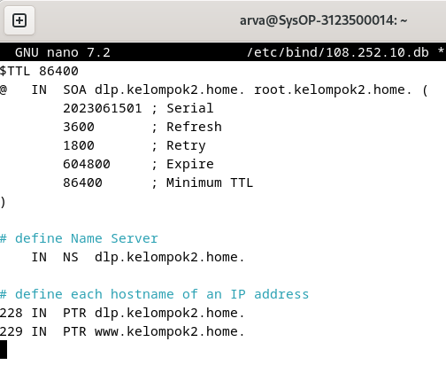

<div align="center">
  <h1 style="text-align: center;font-weight: bold">LAPORAN RESMI<br>WORKSHOP ADMINISTRASI JARINGAN</h1>
  <h4 style="text-align: center;">Dosen Pengampu : Dr. Ferry Astika Saputra, S.T., M.Sc.</h4>
</div>
<br />
<div align="center">
  
  <h3 style="text-align: center;">Disusun Oleh : </h3>
  <p style="text-align: center;">
    <strong>Arva Zaki Fanadzan (3123500014) </strong><br>
  </p>
<h3 style="text-align: center;line-height: 1.5">Politeknik Elektronika Negeri Surabaya<br>Departemen Teknik Informatika Dan Komputer<br>Program Studi Teknik Informatika<br>2024/2025</h3>
  <hr><hr>
</div>

## Pengertian DNS

Domain Name System (DNS) adalah sistem yang mengkonversi nama domain yang mudah diingat oleh manusia (seperti example.com) menjadi alamat IP numerik yang digunakan komputer untuk komunikasi. DNS memungkinkan pengguna untuk mengakses situs web tanpa perlu menghafal alamat IP, sehingga meningkatkan kemudahan penggunaan internet.

## Fitur-Fitur DNS

- **Tersebar Secara Global**: Server DNS dikelola oleh berbagai operator di seluruh dunia
- **Koherensi yang Longgar**: Meskipun terdistribusi, semua server tetap membentuk satu sistem DNS global
- **Dapat Diskalakan**: Sistem dapat diperluas dengan menambah server untuk menangani peningkatan permintaan
- **Handal**: Sebagai komponen vital infrastruktur internet, DNS memiliki tingkat keandalan tinggi
- **Dinamis**: Penambahan domain dan record DNS dapat dilakukan tanpa mengganggu sistem yang sudah berjalan

## Domain dan Namespace

Namespace DNS merupakan struktur hierarkis untuk mengorganisasi dan mengidentifikasi domain secara unik. Domain dibagi menjadi beberapa level:

- **Top-Level Domain (TLD)**: Contoh: .com, .org, .id
- **Second-Level Domain (SLD)**: Contoh: example.com
- **Subdomain**: Contoh: blog.example.com

Struktur ini memungkinkan pengelolaan domain yang terorganisir dan fleksibel.

## Zona dan Delegasi

Zona DNS adalah bagian namespace yang dikelola oleh satu otoritas administratif. Delegasi terjadi ketika otoritas utama menyerahkan pengelolaan sebagian zona kepada pihak lain. Misalnya, pengelolaan subdomain `shop.example.com` dapat didelegasikan kepada tim IT tertentu untuk pengaturan yang lebih spesifik.

## Nameserver

Nameserver adalah server yang menyimpan data DNS dan menangani permintaan penerjemahan nama domain. Terdapat dua jenis nameserver utama:

- **Authoritative Nameserver**: Menyimpan data asli untuk zona tertentu
- **Recursive Nameserver**: Mencari jawaban dengan menelusuri berbagai server hingga menemukan hasil

## DNS Resource Records

Resource record adalah entri database yang menyimpan informasi spesifik tentang domain. Beberapa jenis record penting meliputi:

- **A Record**: Menghubungkan nama domain ke alamat IP
- **CNAME Record**: Menyediakan alias untuk domain lain
- **MX Record**: Menentukan server pengelola email untuk domain
- **TXT Record**: Menyimpan informasi tambahan dalam format teks

## DNS Query

DNS Query adalah proses permintaan informasi DNS dari klien ke server. Jenis-jenis query meliputi:

- **Recursive Query**: Server bertanggung jawab memberikan jawaban lengkap kepada klien
- **Iterative Query**: Server memberikan referensi ke server lain untuk melanjutkan pencarian

## Perintah-Perintah DNS

### `less /etc/nsswitch.conf`

**Penjelasan**: Perintah untuk melihat isi file konfigurasi `nsswitch.conf` yang mengatur urutan pencarian nama dalam sistem (melalui file lokal, DNS, atau layanan lain). Penggunaan `less` memungkinkan pembacaan tanpa risiko mengubah isi file.

### `less /etc/host.conf`

**Penjelasan**: Digunakan untuk membaca file konfigurasi `host.conf` yang mengatur penanganan resolusi nama host dan pengaturan multiple IP untuk satu host. Perintah ini memungkinkan tinjauan tanpa perubahan.

### `nano /etc/hosts`

**Penjelasan**: Membuka file `/etc/hosts` dengan editor teks nano. File ini memetakan nama host ke alamat IP secara manual. Dengan nano, entri dapat ditambahkan atau diedit untuk keperluan tertentu, seperti bypass DNS.

### `sudo less /etc/resolv.conf`

**Penjelasan**: Digunakan untuk membaca file `resolv.conf` yang menentukan server DNS yang digunakan sistem. Perintah sudo diperlukan karena file memiliki hak akses terbatas.

### `nslookup`

**Penjelasan**: Utilitas untuk melakukan query DNS yang digunakan untuk mendapatkan informasi seperti alamat IP dari nama domain atau sebaliknya. Berfungsi sebagai alat troubleshooting masalah DNS.

### `less /usr/share/dns/root.hints`

**Penjelasan**: Membaca file `root.hints` yang berisi daftar server root DNS. Informasi ini digunakan oleh resolver untuk memulai query ke server root jika diperlukan.

## Ekosistem Internet

Internet berkembang pesat berkat tiga faktor utama: kepemilikan global bersama, pengembangan standar terbuka, dan proses pengembangan teknologi dan kebijakan yang dapat diakses secara bebas. Model internet yang terbuka, transparan, dan kolaboratif memungkinkan inovasi berkembang dengan pendekatan bottom-up yang dapat diakses semua pengguna.

### Internet

Internet dapat dipandang dari dua sisi:
- **Sisi teknis**: Terdiri dari sistem routing dan sistem penamaan untuk mengatur lalu lintas data dan mengelola identitas dalam jaringan
- **Sisi arsitektur**: Terdiri dari berbagai standar, penyedia layanan, registri internet, dan clearing houses yang memastikan kelancaran operasional

### IP Addressing & Routing System

Sistem alamat IP berfungsi sebagai identitas unik yang memungkinkan pengiriman data ke tujuan yang tepat. Routing menentukan jalur terbaik bagi data untuk mencapai tujuannya secara efisien, memastikan komunikasi antar perangkat berjalan optimal dalam jaringan internet.

### Routing

Internet terdiri dari jaringan overlay Autonomous Systems (AS) yang membentuk topologi virtual. Setiap AS menerapkan kebijakan routing berbeda sesuai tujuan bisnis dan operasionalnya. Beberapa penyedia layanan mengoptimalkan biaya dan pendapatan dengan menetapkan kebijakan routing yang lebih efisien.

### Peering Connections

Model peering dalam jaringan internet terdiri dari tiga jenis utama: Provider/Customer, Transit, dan Settlement Free. Peering bertujuan mengurangi latensi dan menekan biaya transit data dengan memanfaatkan hubungan langsung antar penyedia layanan.

### Edge Provider Routing Policy

Penyedia layanan di sisi jaringan berusaha menarik sebanyak mungkin lalu lintas untuk meningkatkan efisiensi koneksi. Mereka menggunakan metode hot potato routing, teknik pengiriman data secepat mungkin ke jaringan lain untuk meminimalkan biaya operasional.

### Transit Provider Routing Policy

Transit provider bertanggung jawab atas pengelolaan lalu lintas jaringan antara penyedia layanan akses dan konten. Mereka menerapkan strategi seperti cold potato routing untuk mempertahankan kontrol lebih besar atas data, sehingga dapat mengoptimalkan pengalaman pengguna.

### Content Provider Routing Policy

Penyedia konten berusaha mendistribusikan data sedekat mungkin ke pengguna untuk mengurangi latensi dan meningkatkan kecepatan akses. Mereka menggunakan mekanisme distribusi konten seperti Content Delivery Network (CDN) untuk pengiriman data yang lebih cepat dan efisien.

### Naming System

Sistem penamaan internet memungkinkan pengguna mengakses situs web menggunakan nama domain yang mudah diingat dibandingkan alamat IP. Proses ini membuat navigasi internet menjadi lebih sederhana dan ramah pengguna.

### Root Servers

DNS memiliki 13 root name servers yang tersebar di seluruh dunia untuk mengelola sistem penamaan global. Setiap root server memiliki beberapa instance yang didistribusikan menggunakan teknik anycast, sehingga dapat melayani permintaan dengan lebih cepat dan efisien.

### Standards Organizations

Standarisasi internet dikembangkan oleh berbagai organisasi seperti IETF, ICANN, dan IEEE. IETF (Internet Engineering Task Force) bertanggung jawab atas pengembangan protokol komunikasi seperti TCP/IP, HTTP, dan DNS yang menjadi dasar operasional internet.

### Internet Engineering Task Force (IETF)

IETF didirikan pada 1986 sebagai organisasi yang berfokus pada pengembangan standar internet. Organisasi ini tidak memiliki keanggotaan formal, melainkan terbuka untuk partisipasi publik melalui milis dan pertemuan rutin. Semua keputusan dan pengembangan dilakukan secara transparan dengan kontribusi dari komunitas global.

### Service Providers

Penyedia layanan internet (ISP) bertugas menyediakan akses internet bagi individu dan bisnis. Penyedia layanan terbagi dalam beberapa kategori: Content Providers yang menyediakan konten digital, Access Providers yang memberikan akses jaringan kepada pengguna, dan Transit Providers yang menghubungkan penyedia akses dengan penyedia konten.

### Internet Exchange Point (IXP)

IXP adalah titik pertukaran internet yang memungkinkan penyedia layanan saling terhubung secara langsung di tingkat lokal. IXP membantu mengurangi latensi dan menekan biaya interkoneksi dengan menggantikan sistem perhitungan lalu lintas berbasis biaya dengan model berbasis keanggotaan tetap.

### Registries

ICANN dan IANA bertanggung jawab dalam mengelola sistem penomoran dan penamaan internet. Registri regional seperti APNIC dan RIPE berperan dalam mengalokasikan blok alamat IP kepada penyedia layanan di berbagai wilayah.

### Top Level Registries

Registri domain tingkat atas (TLD) bertanggung jawab atas pengelolaan domain seperti .com, .org, serta ccTLDs (Country Code TLDs) seperti .id untuk Indonesia. ICANN mengawasi pengelolaan TLD dan menetapkannya kepada berbagai registri resmi.

### Second Tier Registries

Registri tingkat kedua bertindak sebagai reseller yang menjual nama domain kepada pengguna akhir. Mereka dapat menentukan harga domain berdasarkan popularitas atau menggabungkannya dengan layanan lain untuk menarik lebih banyak pelanggan.

### Clearing Houses

Clearing houses berperan sebagai pusat koordinasi dalam berbagai kebijakan dan operasional jaringan internet. Lembaga ini memastikan kelancaran komunikasi dan transaksi antara berbagai entitas dalam ekosistem internet.

### Internet Route Registries (IRR)

IRR adalah database kebijakan routing yang digunakan penyedia layanan untuk memvalidasi rute jaringan. Data dalam IRR digunakan untuk memastikan bahwa rute yang diiklankan melalui BGP telah terdaftar dalam basis data yang dipercaya.

### Network Operators Groups (NOGs)

NOGs adalah komunitas operator jaringan yang bertindak sebagai clearing houses untuk berbagi informasi dan praktik terbaik dalam pengelolaan jaringan internet. Organisasi ini sering bekerja sama dengan registri regional, lembaga penelitian, dan vendor teknologi untuk meningkatkan efisiensi dan keamanan jaringan.

## Instalasi DNS Server
Langkah 1:<br>
Instalasi BIND menggunakan perintah `sudo apt -y install bind9 bind9utils`

Langkah 2:<br>
Konfigurasi BIND untuk network internal dalam named.conf menggunakan perintah `sudo nano /etc/bind/named.conf` untuk menambahkan `include "/etc/bind/named.conf.internal-zones";`
<br>Percobaan:
<br><div style=width:500;></div>

Langkah 3:<br>
Konfigurasi BIND untuk network internal dalam named.conf.options menggunakan perintah `sudo nano /etc/bind/named.conf.options` untuk menambahkan: 
```bash
        acl internal-network {
                10.0.0.0/24;
        };
...
...
        # add local network set on [acl] section above
        # network range you allow to recieve queries from hosts
        allow-query { localhost; internal-network; };
        # network range you allow to transfer zone files to clients
        # add secondary DNS servers if it exist
        allow-transfer { localhost; };
        # add : allow recursion
        recursion yes;
```
Percobaan:
<br><div style=width:500;></div>

Langkah 4:<br>
Konfigurasi BIND untuk network internal dalam named.conf.internal-zones menggunakan perintah `sudo nano /etc/bind/named.conf.internal-zones` untuk menambahkan:<br>
```bash
zone "kelompok2.home" IN {
        type master;
        file "/etc/bind/kelompok2.home.lan";
        allow-update { none; };
};
zone "108.252.10.in-addr.arpa" IN {
        type master;
        file "/etc/bind/108.252.10.db";
        allow-update { none; };
};
```
Percobaan:
<br><div style=width:500;></div>

Langkah 5:<br>
Konfigurasi BIND untuk network internal dalam /default/named menggunakan perintah `sudo nano /etc/default/named` untuk menambahkan:<br>
```bash
# add
OPTIONS="-u bind -4"
```
Percobaan:
<br><div style=width:500;></div>

Langkah 6:<br>
Membuat file zona yang digunakan server untuk menyelesaikan alamat IP dari nama domain, menggunakan perintah `sudo nano /etc/bind/kelompok2.home.lan`
<br>Percobaan:
<br><div style=width:500;></div>

Langkah 7:<br>
Buat file zona yang memungkinkan server mengubah nama domain menjadi alamat IP menggunakan perintah `sudo nano /etc/bind/108.252.10.db`
<br>Percobaan:
<br><div style=width:500;></div>

Langkah 8:<br>
Verifikasi Resolusi Nama dan Alamat menggunakan `dig dlp.kelompok2.home.` 
<br>Percobaan:
<br><div style=width:500;></div>
