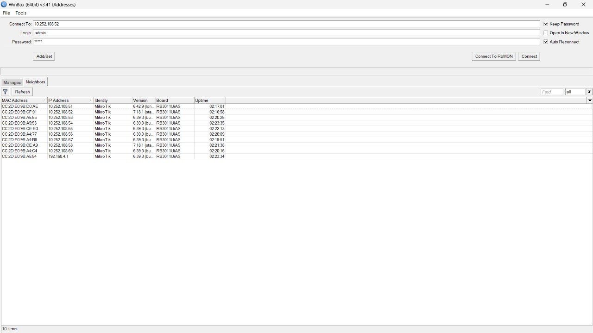
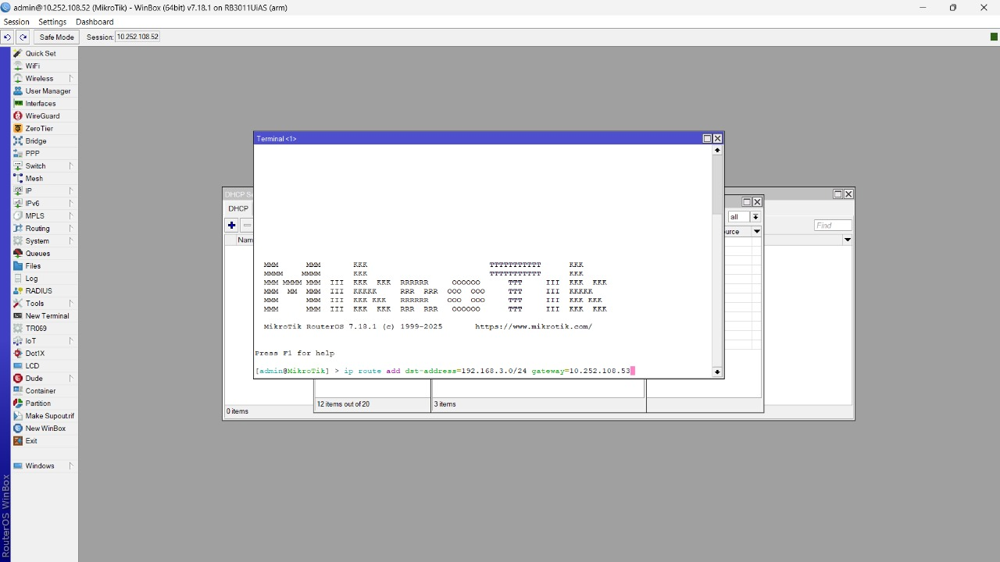
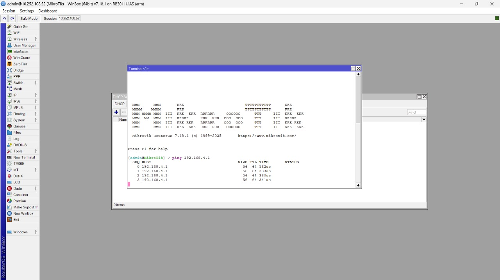
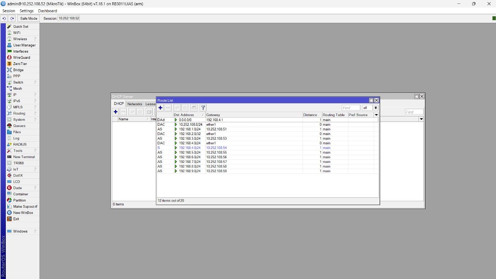

  <h1 style="text-align: center;font-weight: bold">LAPORAN RESMI WORKSHOP ADMINISTRASI JARINGAN</h1>
  <h4 style="text-align: center;">Dosen Pengampu : Dr. Ferry Astika Saputra, S.T., M.Sc.</h4>

 

  
  <h3 style="text-align: center;">Disusun Oleh : </h3>
  

    <strong>Arva Zaki Fanadzan (3123500014) </strong> 
  

<h3 style="text-align: center;line-height: 1.5">Politeknik Elektronika Negeri Surabaya Departemen Teknik Informatika Dan Komputer Program Studi Teknik Informatika 2024/2025</h3>
  

## Daftar Isi
- [Daftar Isi](#daftar-isi)
- [Konfigurasi Mikrotik](#konfigurasi-mikrotik)

## Konfigurasi Mikrotik
Langkah 1: 
Unduh WinBox di `https://mikrotik.com/download`.
 Gambar:
 

Langkah 2: 
Buka file WinBox yang telah diunduh, Isi connect to sesuai IP router mikrotik yang sedang dipakai. Untuk Login dan Password gunakan admin.
 Gambar:
 

Langkah 3: 
Jika sudah berhasil terhubung, buka terminal dengan menekan menu new terminal. Lalu tambahkan routing dengan perintah `ip route add dst-address=<tujuan-network> gateway=<IP-router>` 
 Gambar:
 

Langkah 4: 
Setelah selesai menambahkan routing, lakukan testing ping menggunakan perintah `ping <IP-dalam-network>`
 Gambar:
 

Langkah 5: 
Tambahkan semua routing untuk network kelompok lain.
 Gambar:
 

